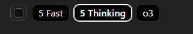
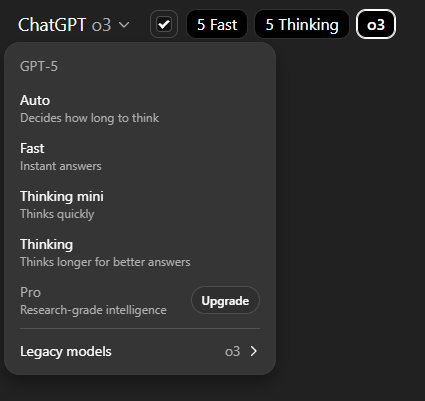

# Quick Model Switcher for ChatGPT — How to Use


<br>

<br>

<br>


This guide shows how to add a **row of model buttons** to ChatGPT, hide/show the native dropdown with a **checkbox**, and remember your last used model — all **without page refreshes**.

---

## 1) Requirements

- **Chrome** (or any Chromium browser)
- The extension **“User JavaScript and CSS”** (from the Chrome Web Store)

> This runs 100% locally. No data leaves your browser. You can remove it at any time.

---

## 2) Install & Scope the extension

1. Install **User JavaScript and CSS**.
2. Open its options page and add a new **site entry** for:
   - `https://chatgpt.com/*`  
     *(optional: add `https://chat.openai.com/*` if you still use that host)*
3. In that site entry, paste your **CSS** in the CSS box and your **JavaScript** in the JS box.
4. Save.

> Tip: if the extension has a setting for *run-at*, choose **document-end** (default is fine).  
> If you ever tweak CSS/JS, reload the ChatGPT tab to apply.

---

## 3) What you get

- A **quick-switch bar** of model buttons added into the header (right of the model text).
- A **small checkbox** (fixed size) to **show/hide the native dropdown** so the header doesn’t “jump”.
- **No page reload** when switching models (it updates via the History API).
- **Remembers** the **last used** model and reapplies it on the home screen.
- **Auto-learns** the *real* model keys the site expects (see “Learning keys” below).

---

## 4) Show/Hide the native dropdown

- The little checkbox to the **left** of the quick bar toggles **“Show dropdown model picker”**.
- **Checked** → dropdown visible (useful the first time you teach/learn mappings).  
- **Unchecked** → dropdown hidden (prevents layout shifts when the model label changes).
- Your preference is saved and persists across sessions.

---

## 5) Customize the buttons

You can **remove**, **reorder**, or **comment out** the items in the `BUTTONS` list.  
*(This list lives near the top of your userscript.)*

```js
const BUTTONS = [
  { label: '5 Fast',          fallbacks: ['gpt-5-instant'] },
  { label: '5 Thinking',      fallbacks: ['gpt-5-thinking'] },
  { label: '5 Thinking mini', fallbacks: ['gpt-5-t-mini', 'gpt-5-thinking-mini', 'gpt-5-mini', 'gpt-5-thinking-fast'] },
  { label: 'GPT-4o',          fallbacks: ['gpt-4o'] },
  { label: 'GPT-4.1',         fallbacks: ['gpt-4.1', 'gpt-4-1', 'gpt4.1'] },
  { label: 'o3',              fallbacks: ['o3'] },
  { label: 'o4-mini',         fallbacks: ['o4-mini'] },
]
```

- **Reorder** the objects to change the button order.
- **Comment out** or delete any object to remove that button.
- **Add** new models by following the shape `{ label, fallbacks }`.

---

## 6) How “learning” works (first-time setup)

Some models use internal keys that differ from the label (e.g., “5 Thinking mini” → `gpt-5-t-mini`).  
The script learns these automatically:

1. Keep the checkbox **checked** (dropdown visible).
2. Use the **native dropdown** once to select each model at least one time.
3. The script detects the resulting URL key and saves a mapping: **label → key**.
4. After that, your quick buttons will switch without reload and without the dropdown.

> You can also seed or fix a mapping manually in the Console:
> ```js
> __qm.setMapping('5 Thinking mini', 'gpt-5-t-mini')
> ```

---

## 7) Useful Console helpers (optional)

- **See current mapping table**  
  `__qm.map()`
- **Clear the mapping cache** (if you want to re-learn)  
  `__qm.clear()`
- **Programmatically select a model by label**  
  `__qm.select('GPT-4o')`
- **Quick state check** (header label, URL param, etc.)  
  `__qm.state()`
- **Manually set a mapping**  
  `__qm.setMapping('5 Thinking mini', 'gpt-5-t-mini')`

> Mappings and preferences are stored in `localStorage` under keys like:
> - `qm_modelKeyByLabel_v2` (label → key map)  
> - `qm_lastLabel_v2` (last used label)  
> - `qm_show_native_picker` (checkbox state)

---

## 8) Troubleshooting

- **A button doesn’t work yet**  
  Use the native dropdown to pick that model once (with the checkbox **on**). Then try the button again.
- **Dropdown briefly flashes when sending a message**  
  This is already handled by applying the “hide” class on `<html>`, which is stable across re-renders. If you still see a flash, ensure you updated to the latest CSS/JS with that change.
- **The bar moved or styles changed after a site update**  
  You can put the bar inside the left header wrapper or keep your CSS override that sets:
  - `#page-header { justify-content: flex-start !important }`
  - `#page-header > .flex.items-center:last-of-type { margin-left: auto }`
- **Dark-mode checkbox looks too bright**  
  The CSS uses a **custom-styled** checkbox with a dark fill and white checkmark.

---

## 9) Safety & scope

- This is a **local UI enhancement**. It doesn’t bypass permissions, doesn’t send data elsewhere, and doesn’t reload pages.
- If you disable or remove the userscript, ChatGPT returns to normal immediately.

---

## 10) Uninstall / Disable

- Toggle off or delete the site entry in **User JavaScript and CSS**, then refresh ChatGPT.
- If you want to wipe local settings: open DevTools Console and run `__qm.clear()`.

---

### That’s it!

Once the mappings are learned (or seeded), you can hide the dropdown with the checkbox and enjoy **one-click model switching** that never shifts your header around.
